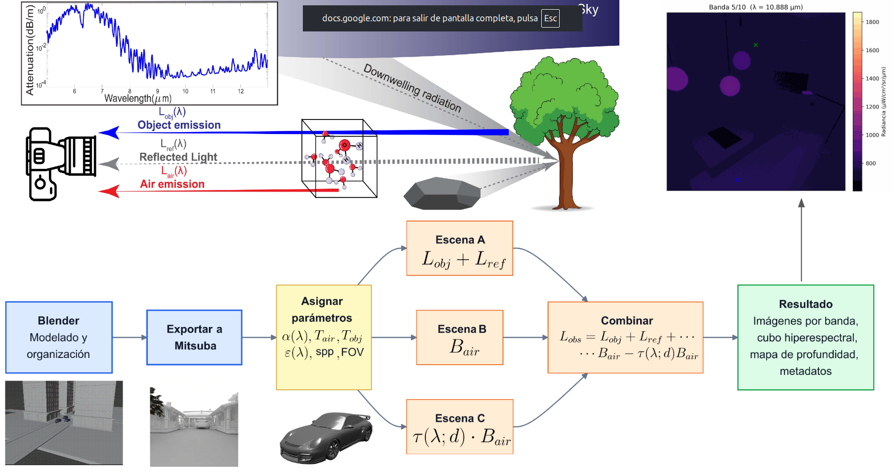

<div align="center">
    <h1>🌡️ MiThermal</h1>
    <p><strong>Simulador de Imágenes Hiperespectrales en el Infrarrojo de Onda Larga (LWIR)</strong></p>
</div>

---

## 📋 Descripción General

**MiThermal** es un simulador de alta precisión para la adquisición de imágenes hiperespectrales en el rango del infrarrojo de onda larga (LWIR) a partir de escenarios 3D. El simulador modela la propagación de radiación térmica emitida por objetos con propiedades físicas reales (temperatura, emisividad espectral) y considerando los efectos de absorción atmosférica, generando imágenes más representativas de escenarios reales.

### ¿Para qué se usa?

MiThermal es una herramienta fundamental para:

- **Investigación en Teledetección**: Modelar adquisiciones de sensores LWIR hiperespectrales en entornos 3D
- **Generación de Datos Sintéticos**: Crear conjuntos de datos de entrenamiento para modelos de inteligencia artificial
- **Análisis Espectral**: Estudiar la firma espectral de materiales en el rango infrarrojo
- **Validación de Fenómenos Físicos**: Verificar interacciones de radiación térmica y absorción atmosférica
- **Monitoreo y Defensa**: Simular escenarios para seguridad industrial e inspección

---

## 🎯 Objetivos del Proyecto

### Objetivo General

Desarrollar un simulador para la adquisición de imágenes hiperespectrales en el rango del infrarrojo de onda larga (LWIR) a partir de escenarios 3D con propiedades físicas como temperatura y emisividad, considerando la absorción de la luz generada por su propagación a través de la atmósfera.

### Objetivos Específicos

1. **Diseño de Escenarios 3D**: Crear escenarios 3D con objetos que incluyan propiedades físicas relevantes para LWIR (temperatura, emisividad espectral de materiales)

2. **Modelado de Radiación Térmica**: Modelar la propagación de radiación térmica emitida por objetos 3D y su interacción con la atmósfera, considerando efectos de absorción

3. **Implementación en Python**: Desarrollar un algoritmo en Python para generar imágenes hiperespectrales LWIR utilizando librerías especializadas en renderización (Mitsuba) y computación científica

4. **Validación**: Validar el simulador por medio de datos experimentales o modelos teóricos disponibles, evaluando la precisión de la simulación en función de la respuesta espectral y coherencia con fenómenos físicos

---

## 🌍 Justificación

Las imágenes térmicas en el rango LWIR son herramientas fundamentales en diversas aplicaciones como:
- 🛰️ **Teledetección** y **monitoreo ambiental**
- 🔒 **Seguridad y defensa**
- 🏭 **Inspección industrial**
- 🔧 **Diagnóstico de fallas en infraestructuras**

A diferencia del espectro visible, las imágenes LWIR detectan diferencias de temperatura sin iluminación externa, siendo esenciales para condiciones de baja visibilidad (noche, humo, niebla).

### Desafíos Actuales

- **Alto costo** de sensores hiperespectrales LWIR
- **Complejidad** de sistemas de captura
- **Influencia de factores atmosféricos** en la propagación de radiación térmica
- **Acceso limitado** a conjuntos de datos públicos de imágenes LWIR hiperespectrales
- **Simuladores privatizados** o con licencias costosas

### Solución

MiThermal proporciona una alternativa **abierta y accesible** para investigadores y desarrolladores, permitiendo:
- Generar datos sintéticos de alta calidad para entrenar modelos de IA
- Modelar escenarios complejos con propiedades físicas realistas
- Incorporar efectos atmosféricos en las simulaciones

---

## ✨ Características Principales

- ✅ **Renderización 3D Realista** usando Mitsuba 3
- ✅ **Propiedades Físicas** de materiales (temperatura, emisividad espectral)
- ✅ **Modelado Atmosférico** con absorción y atenuación
- ✅ **Imágenes Hiperespectrales** en el rango LWIR
- ✅ **Base de Datos de Materiales** con espectros reales
- ✅ **Interfaz Web** intuitiva con Gradio
- ✅ **API REST** para integración con otros sistemas
- ✅ **Validación** contra datos teóricos y experimentales

---

## 🏗️ Estructura del Proyecto

```
miThermal/
├── src/                           # Código principal
│   ├── app.py                    # Aplicación principal Gradio
│   ├── config.py                 # Configuración
│   ├── api/                      # Rutas de la API REST
│   ├── atmosphere/               # Modelado atmosférico
│   ├── data_processing/          # Procesamiento de datos
│   ├── gradio_interface/         # Interfaz web Gradio
│   ├── mitsuba_core/             # Motor de renderización Mitsuba
│   └── utils/                    # Utilidades
├── assets/                        # Datos y recursos
│   ├── reference_data/           # Datos de referencias (gases, materiales)
│   ├── signatures/               # Firmas espectrales de materiales
│   ├── mitsuba_scenes/           # Escenas 3D para Mitsuba
│   ├── images/                   # Imágenes de prueba
│   └── camera_responses/         # Respuestas de cámara
├── notebooks/                     # Notebooks de Jupyter para análisis
├── scripts/                       # Scripts de utilidad
├── tests/                         # Pruebas unitarias
├── config/                        # Archivos de configuración
├── requirements.txt              # Dependencias
├── pyproject.toml               # Configuración del proyecto
└── README.md                    # Este archivo
```

---

## 📦 Instalación

### Requisitos Previos

- **Python** 3.11 o superior
- **pip** o **conda** para gestión de dependencias
- GPU recomendada para un mejor desempeño (CUDA compatible)

### Pasos de Instalación

1. **Clonar el repositorio**
   ```bash
   git clone <URL_DEL_REPOSITORIO>
   cd miThermal
   ```

2. **Crear entorno virtual** (recomendado)
   ```bash
   python3.11 -m venv venv
   source venv/bin/activate  # En Windows: venv\Scripts\activate
   ```

3. **Instalar dependencias**
   ```bash
   pip install -r requirements.txt
   ```

   O si usas `pyproject.toml`:
   ```bash
   pip install -e .
   ```

### Dependencias Principales

- **mitsuba**: Renderizador 3D de alta precisión
- **fastapi**: Framework para API REST
- **gradio**: Interfaz web intuitiva
- **numpy, scipy**: Computación científica
- **pandas**: Procesamiento de datos
- **trimesh, open3d**: Procesamiento de geometría 3D

---

## 🚀 Uso

### Interfaz Web (Gradio)

Para ejecutar la interfaz web interactiva:

```bash
python run_client.py
```

Accede a `http://localhost:7860` en tu navegador.

### API REST (FastAPI)

Para ejecutar el servidor API:

```bash
python run_server.py
```

La documentación interactiva estará disponible en `http://localhost:8000/docs`.

## 🔍 Bases de Datos Incluidas

### Datos de Referencia (`assets/reference_data/`)
- **Absorbancia de gases atmosféricos**: Aire, CO₂, CH₄, H₂O, O₃
- **Base de datos de materiales**: ~1000+ materiales espectrales JHU

### Firmas Espectrales (`assets/signatures/`)
- Concreto, cemento, ladrillo, acero y otros materiales de construcción
- Datos espectrales en alta resolución para el rango LWIR

---

## 📊 Notebooks de Análisis

Explora análisis detallados en:
- `intro_spectral.ipynb`: Introducción a datos espectrales
- `gaussia_response.ipynb`: Respuesta espectral de cámaras
- `valid_simulator.ipynb`: Validación del simulador
- `validations.ipynb`: Conjunto completo de validaciones

---

## 👨‍🎓 Información del Proyecto

- **Tipo**: Trabajo de Grado / Investigación
- **Versión**: 1.0 
- **Lenguaje Principal**: Python 3.11+

---

## 📝 Licencia

Este proyecto está bajo licencia [MIT](LICENSE) - ver el archivo LICENSE para más detalles.

---

**Última actualización**: Enero 2026
